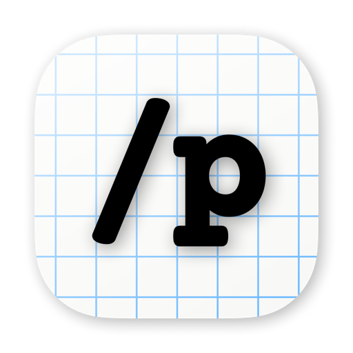

<p align="center">
  
</p>

<h1 align="center">Push</h1>

<p align="center">
  <strong>The terminal that remembers your agent sessions — on your Mac and in your pocket.</strong>
</p>

<p align="center">
  <a href="https://push.computer"><strong>Website</strong></a> &middot;
  <a href="https://github.com/MasslessAI/push/issues/new/choose"><strong>File an issue</strong></a> &middot;
  <a href="https://github.com/MasslessAI/push/issues"><strong>Browse issues</strong></a>
</p>

<p align="center">
  <a href="https://github.com/MasslessAI/push/issues?q=is%3Aissue+is%3Aopen+label%3Amacos"></a>
  <a href="https://github.com/MasslessAI/push/issues?q=is%3Aissue+is%3Aopen+label%3Aios"></a>
</p>

---

## What this repo is

This is the **public issue tracker** for Push — across **both** the macOS app and the iOS app. **It contains no source code; it exists for issue tracking only.**

Push is a closed-source application — it is **not open source**. Its code lives in private repositories. What lives in the open, here, is the tracking: bugs, feature requests, and roadmap. If something is broken, missing, or could be better, this is the place to say so, and to watch it get fixed. One tracker, both platforms.

> 👉 **Found a bug or have an idea?** [**Open an issue**](https://github.com/MasslessAI/push/issues/new/choose).

## What is Push?

Push is a terminal built around code agents. Quit the app, open it tomorrow, and your Claude Code session is right where you left it — same for **Codex**, **OpenCode**, and **Hermes**. Naming, resume, and history that work across all four.

Behind the terminal is a whole system: a heartbeat scheduler, an issue board, a feed for approvals, and a relay that reaches your Mac from your phone or browser.

| | |
| --- | --- |
| **Push for macOS** | A Mac-native terminal for code agents — libghostty + Metal, multi-tab, session resume, an issue board, and a relay to your phone. Free download for macOS 14+ (Apple Silicon). |
| **Push for iOS** | The companion app — watch your agents, capture issues by voice, approve work, and drive a live terminal from your phone. |

**Get Push:**

- **macOS** — download from **[push.computer](https://push.computer)**, or:
  ```sh
  brew install --cask masslessai/push/push
  ```
- **iOS** — watch **[push.computer](https://push.computer)** for availability.

## Filing a good issue

Clear issues get fixed faster. When you open one:

1. **Pick the right template** — [Bug report](https://github.com/MasslessAI/push/issues/new/choose) or [Feature request](https://github.com/MasslessAI/push/issues/new/choose).
2. **Tell us the platform** — macOS, iOS, or both. The template asks; it drives the `macos` / `ios` labels we track by.
3. **Include the version** — find it in the app (macOS: *Push → About Push*; iOS: *Settings → About*).
4. **For bugs** — what you did, what you expected, what happened. A screenshot or a short screen recording helps a lot.
5. **Security?** — please don't file it publicly. See [SECURITY.md](SECURITY.md).

## How we track issues

Everything is tracked with a small, consistent set of labels so you can always see the state of things at a glance:

| Label | Meaning |
| --- | --- |
| [`macos`](https://github.com/MasslessAI/push/labels/macos) | Affects the Mac app |
| [`ios`](https://github.com/MasslessAI/push/labels/ios) | Affects the iOS app |
| [`bug`](https://github.com/MasslessAI/push/labels/bug) | Something isn't working |
| [`enhancement`](https://github.com/MasslessAI/push/labels/enhancement) | A new idea or improvement |
| [`needs-info`](https://github.com/MasslessAI/push/labels/needs-info) | We need more detail to proceed |
| [`fixed-pending-release`](https://github.com/MasslessAI/push/labels/fixed-pending-release) | Fixed in code, shipping in the next release |

**Live views:**

- 🐛 [Open bugs](https://github.com/MasslessAI/push/issues?q=is%3Aissue+is%3Aopen+label%3Abug)
- 🍎 [Open macOS issues](https://github.com/MasslessAI/push/issues?q=is%3Aissue+is%3Aopen+label%3Amacos) · 📱 [Open iOS issues](https://github.com/MasslessAI/push/issues?q=is%3Aissue+is%3Aopen+label%3Aios)
- ✅ [Fixed, pending release](https://github.com/MasslessAI/push/issues?q=is%3Aissue+label%3Afixed-pending-release)
- 💡 [Feature requests](https://github.com/MasslessAI/push/issues?q=is%3Aissue+is%3Aopen+label%3Aenhancement) — 👍 react to vote

## Acknowledgments

Push is built by Massless AI. We're grateful to the open-source projects that made it possible — and we want to be precise about how each one relates to Push.

### Ghostty — the terminal under everything

**Push's entire terminal experience is built on [Ghostty](https://github.com/ghostty-org/ghostty).** We embed `libghostty` (the `GhosttyKit` framework) to render every terminal pane — the GPU-rendered output, the scrollback, the speed. Huge thanks to **Mitchell Hashimoto** and the Ghostty community; Push's native terminal simply would not exist without it.

Ghostty is MIT-licensed. We use its code, and we keep its copyright and license notice in the shipped app bundle (`LICENSES.md`), as MIT requires.

### Paperclip — early foundations

Some of Push's earliest foundations drew on code from [Paperclip](https://github.com/paperclipai/paperclip). Portions licensed under the Apache License 2.0 remain in Push today and are retained under that license — see the `LICENSES.md` shipped inside the app bundle. Push has since been substantially rewritten and is developed independently. With thanks to the Paperclip authors.

### Inspirations & kindred projects

Push also draws inspiration from several projects we admire. **To be unambiguous: Push is an independent implementation and does not use, copy, link, or incorporate the source code of any project below — our acknowledgment is for their ideas and direction, not their code.**

- **[cmux](https://github.com/manaflow-ai/cmux)** (GPL-3.0-or-later) — a terminal built for AI coding agents; it helped shape our conviction that the terminal is the right home for agents. cmux is GPL-licensed, and to be unambiguous: **Push contains none of its source code.**
- **[OpenWhispr](https://github.com/OpenWhispr/openwhispr)** (MIT) — on-device voice dictation; an inspiration for Push's voice capture.
- **[anarlog](https://github.com/fastrepl/anarlog)** (MIT) — an open-source meeting-notes app; an inspiration for Push's meeting and voice capture.

With thanks to all of their authors and communities.

## Links

- 🌐 Website — [push.computer](https://push.computer)
- 🐛 Issues — [github.com/MasslessAI/push/issues](https://github.com/MasslessAI/push/issues)

---

<p align="center">
  Made by <a href="https://github.com/MasslessAI"><strong>Massless AI</strong></a>
</p>
